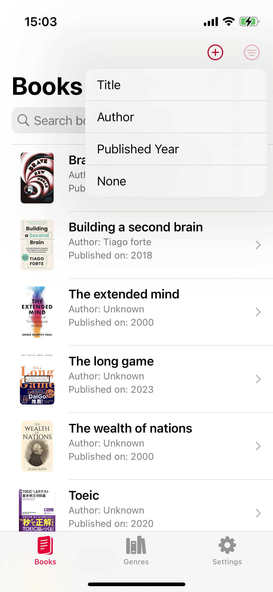
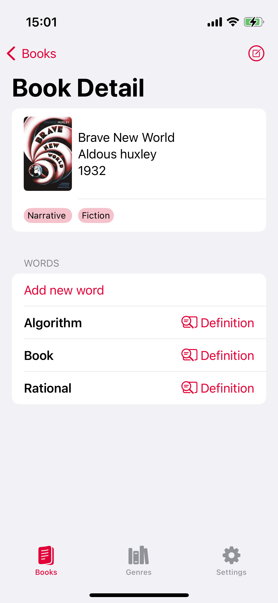

# VocabularyRemember App With SwiftUI & Vapor

VaporとSwiftUIでオンライン機能を持つ英単語記憶アプリ

# 機能

- [x] 読んでいる本を追加
- [x] 本の中でのわからなかった単語を本に追加
- [x] 単語に対してAppleの内蔵DictionaryAPIを読んで辞書画面を表示(たまに内蔵辞書画面で結果が出ない問題の調査が必要)
- [x] 他の様々な記憶ステータス管理、フィルタリング、トラッキング
- [x] 本に所属のジャンルを設定
- [x] ログイン機能：現在はローカルサーバーのみにで開発
- [x] サーバーからデータGET、POST（オフライン優先で開発中の為非アクティブ）

# TODO:
- [] たまに内蔵辞書画面で結果が出ない問題の調査が必要
- [] コードのクリーンアップ：（オンライン機能を同時に開発からオフライン優先で開発中の為）
- [] アーキテクチャの検討

## Plan
- 単語に所属のトピックを設定
- オンライン機能
    - [] シンキング
    - [] ユーザーお互いにFollow
    - [] 相手の単語リストを確認
    - [] 取得済みのGoogleBook API　検査レスポンスの表示UI/UX

お互いのどんなことを確認できるか？
1. 全てのユーザーが作成した単語リスト、所属のカテゴリ (Planning)
2. ユーザー毎の単語リスト、暗記(理解)済みの単語リスト、数量　(Planning)
3. 学習ステータストラッキング (Planning)

|      |      |      |      |
|:----:|:----:|:----:|:----:|
|  |  |  |  |
|  |  |  |  |
|  |